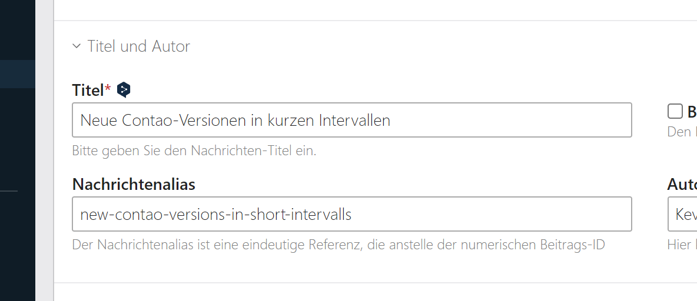

Contao DeepL Translation Helper
====================

[](https://packagist.org/packages/numero2/contao-deepl) [](http://www.gnu.org/licenses/lgpl-3.0)


## About

This extension allows you to translate individual fields within a DCA (Data Container Array) with just one click, leveraging the [DeepL](https://www.deepl.com) API for accurate translations. It also includes caching of previously translated texts to optimize performance and minimize API calls.


## System requirements

* [Contao 5.x](https://github.com/contao/contao)
* [DeepL](https://www.deepl.com/de/your-account/keys) API Key (free or paid plan)


## Installation & Configuration

* Install the extension via Contao Manager or Composer (`composer require numero2/contao-deepl`)
* Add your [DeepL](https://www.deepl.com/de/your-account/keys) API Key to your `.env`
  > `DEEPL_API_KEY=xxxxxxxx-xxxx-xxxx-xxxx-xxxxxxxxxxxx`
* Alternatively, you can add the API key to your `config/config.yaml`
```
deepl:
    api_key: 'xxxxxxxx-xxxx-xxxx-xxxx-xxxxxxxxxxxxx'
```
* A preferred mapping can be created for language variants (e.g. British English en-GB, Brazilian Portuguese pt-BR, etc.). The exact language code to be used can be found at Deepl.com.
```
deepl:
    api_key: 'xxxxxxxx-xxxx-xxxx-xxxx-xxxxxxxxxxxxx'
    pref_lang:
      en:en-GB
      pt:pt-BR
```
## Usage

After installation, each field that can be translated will display a small DeepL translation icon  next to its label. Once clicked, DeepL will automatically translate the text in the field to match the language of your current page settings.



💡 **Hint:** You can also translate all fields at once by pressing `ALT+T` on Windows or `Option+T` on Mac.

## Supported bundles

This extension supports the following Contao bundles:
* [contao/core-bundle](https://github.com/contao/core-bundle)
* [contao/news-bundle](https://github.com/contao/news-bundle)
* [contao/calendar-bundle](https://github.com/contao/calendar-bundle)
