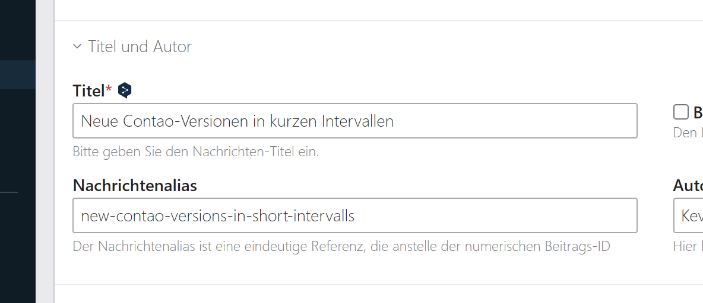

Contao DeepL Translation Helper
====================

[](https://packagist.org/packages/numero2/contao-deepl) [](http://www.gnu.org/licenses/lgpl-3.0)


## About

This extension allows you to translate individual fields within a DCA (Data Container Array) with just one click, leveraging the [DeepL](https://www.deepl.com) API for accurate translations. It also includes caching of previously translated texts to optimize performance and minimize API calls.


## System requirements

* [Contao 5.3](https://github.com/contao/contao) (or newer)
* [DeepL](https://www.deepl.com/de/your-account/keys) API Key (free or paid plan)


## Installation & Configuration

* Install the extension via Contao Manager or Composer (`composer require numero2/contao-deepl`)
* Add your [DeepL](https://www.deepl.com/de/your-account/keys) API Key to your `.env`
  > `DEEPL_API_KEY=xxxxxxxx-xxxx-xxxx-xxxx-xxxxxxxxxxxx`
* Alternatively, you can add the API key to your `config/config.yaml`
```
deepl:
    api_key: 'xxxxxxxx-xxxx-xxxx-xxxx-xxxxxxxxxxxxx'
```
* A preferred mapping can be created for language variants (e.g. British English en-GB, Brazilian Portuguese pt-BR, etc.). The exact language code to be used can be found at Deepl.com.
```
deepl:
    api_key: 'xxxxxxxx-xxxx-xxxx-xxxx-xxxxxxxxxxxxx'
    pref_lang:
      en:en-GB
      pt:pt-BR
```

### Glossaries

A glossary keeps your terminology out of the translation: product names, brand
terms, wording that must stay as it is. Create and maintain the glossaries in
the [DeepL web app](https://www.deepl.com/translator) and reference their IDs
per language pair, written in base language codes:

```
deepl:
    api_key: 'xxxxxxxx-xxxx-xxxx-xxxx-xxxxxxxxxxxxx'
    source_lang: 'de'
    glossaries:
      de-en: 'xxxxxxxx-xxxx-xxxx-xxxx-xxxxxxxxxxxx'
      de-fr: 'xxxxxxxx-xxxx-xxxx-xxxx-xxxxxxxxxxxx'
```

DeepL only accepts a glossary when the source language is explicit, so a source
language has to be known. It is determined in this order:

1. **The fallback language of the site the record belongs to.** In the usual
   multilingual setup — one language tree per language, one of them the
   fallback — that *is* the language you translate from, and it is derived per
   site, so an installation hosting several sites in different main languages
   gets the right answer for each. Nothing to configure.
2. **`source_lang`**, when the first yields nothing. That happens when a root
   page is its own fallback, which is the normal shape of a one-domain-per-
   language setup.

If neither yields a language, the text is translated **without** a glossary
rather than with a guessed source. A wrong source language means DeepL silently
finds no glossary for the pair, and nobody notices that the terminology was not
applied.

Glossaries exist for base languages only (`en`, not `en-US`), so the regional
variant is stripped for the lookup while the translation itself keeps the full
target code.

## Usage

After installation, each field that can be translated will display a small DeepL translation icon  next to its label. Once clicked, DeepL will automatically translate the text in the field to match the language of your current page settings.



💡 **Hint:** You can also translate all fields at once by pressing `ALT+T` on Windows or `Option+T` on Mac.

## Supported bundles

This extension supports the following Contao bundles:
* [contao/core-bundle](https://github.com/contao/core-bundle)
* [contao/news-bundle](https://github.com/contao/news-bundle)
* [contao/calendar-bundle](https://github.com/contao/calendar-bundle)
